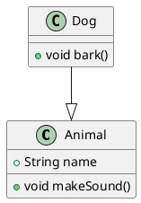

1、下面是一个泳道图
```plantuml
Cat -> Dog : hello
Dog -> Cat : hi
```
2、下面是一个类图

```plantuml
@startuml

class Animal {
  +String name
  +void makeSound()
}

class Dog {
  +void bark()
}

Dog --|> Animal

@enduml
```

